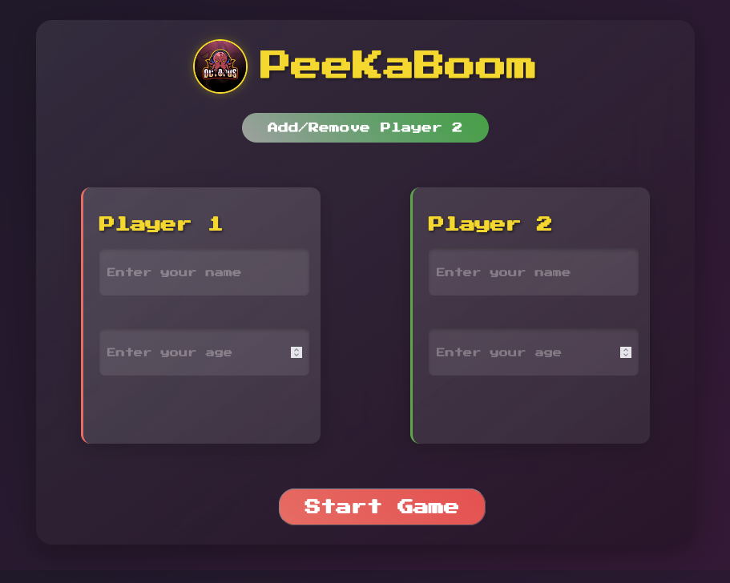
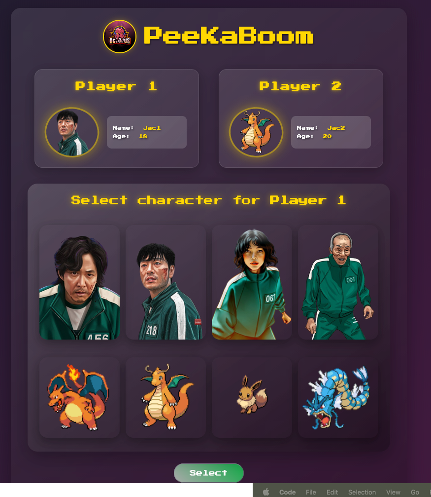
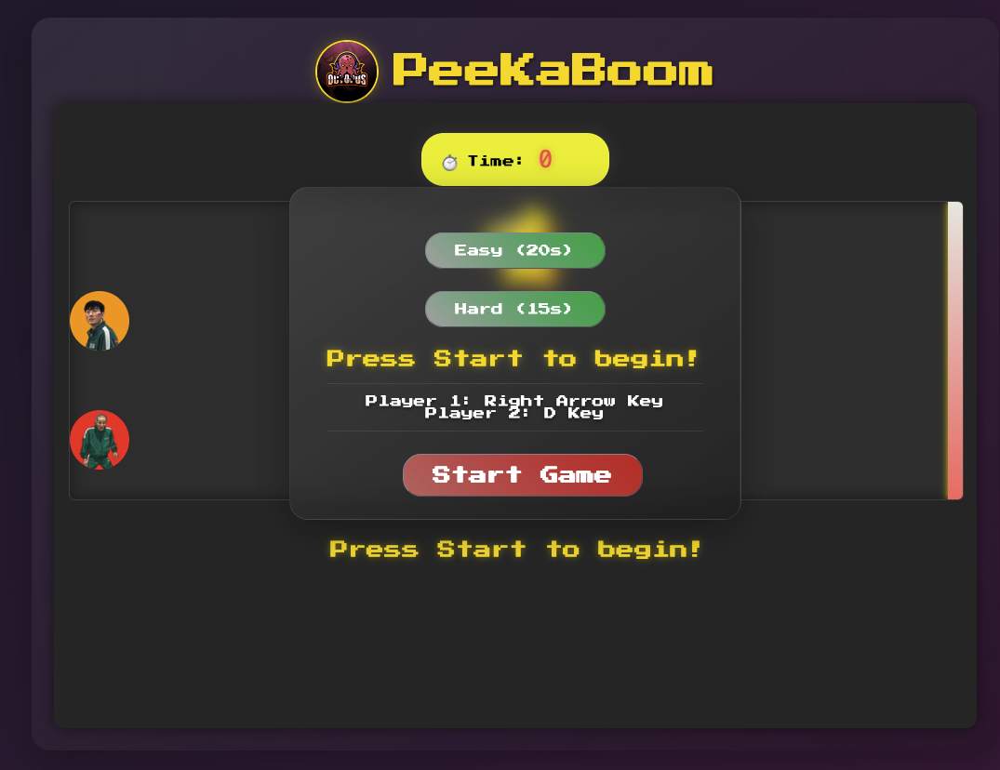
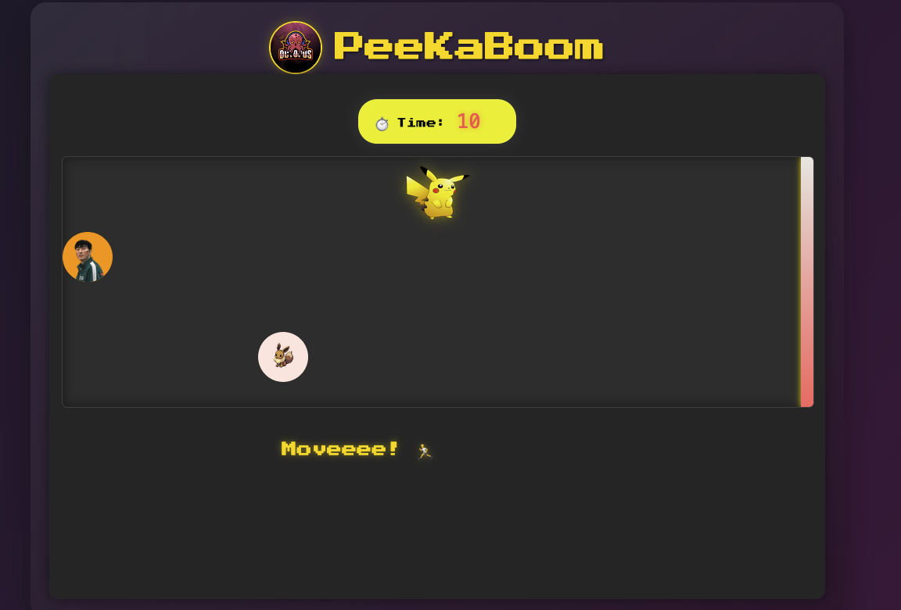

# 🎮 PeeKaBoom Game

A fun and interactive browser-based racing game inspired by **“Red Light, Green Light”** from *Squid Game* — but with a twist:  
**Pikachu** is the watcher, and players must freeze whenever he turns around!  
Run, stop, customize characters, and compete to reach the finish line first!

---

## 🖼️ Game Gallery

### Game Concept
PeeKaBoom is a timing-based racing game where players move only when Pikachu isn’t watching.  
If Pikachu catches you moving — you’re out!  
Customize your character, pick skins, choose difficulty, and race against another player or the clock.

---

## 🎯 Overview

PeeKaBoom is a competitive browser game featuring:

- Character selection from *Squid Game* and *Pokémon*
- Dynamic Pikachu “watching” system  
- Timing-based start/stop movement  
- Single-player or two-player mode  
- Customizable character skin colors  
- Real-time racing and countdown timer  

---

## 📸 Game Screenshots

### 1. Player Information Input
Enter player names and ages to begin your adventure.

### 2. Character Selection
Choose your character from the Squid Game or Pokémon roster.

### 3. Game Start
Watch Pikachu closely and get ready to run!

### 4. Gameplay
Move when Pikachu isn’t watching — freeze when he turns around!

---

## 🎨 Character Gallery

### Squid Game Characters

<table>
  <tr>
    <td align="center">
       
      <b>Seong Gi-hun</b> Player 456
    </td>
    <td align="center">
       
      <b>Cho Sang-woo</b> Player 218
    </td>
    <td align="center">
       
      <b>Kang Sae-byeok</b> Player 067
    </td>
  </tr>
  <tr>
    <td align="center">
       
      <b>Oh Il-nam</b> Player 001
    </td>
    <td align="center">
       
      <b>Jang Deok-su</b> Player 101
    </td>
  </tr>
</table>

---

### The Watcher — Pikachu

<table>
  <tr>
    <td align="center">
       
      <b>Pikachu Watching</b> Don't move! 👀
    </td>
    <td align="center">
       
      <b>Pikachu Not Watching</b> Move now! 🏃
    </td>
  </tr>
</table>

---

### Pokémon Characters  
(Fetched dynamically from PokeAPI)

- 🔥 **Charizard**
- 🐉 **Dragonite**
- 🦊 **Eevee**
- 🌊 **Gyarados**

---

## ✨ Features

### Character Selection
- Choose between **Squid Game** and **Pokémon** characters
- Customize skin color (5 color options)
- Supports **1 or 2 players**

### Gameplay
- **Difficulty Levels**:
  - Easy → 20 seconds
  - Hard → 15 seconds
- **Dynamic Pikachu Watcher** (random intervals)
- **Keyboard Controls**:
  - Player 1 → Right Arrow Key (→)
  - Player 2 → D Key
- Real-time timer
- Win/Lose detection system

### User Interface
- Player registration form with validation
- Character + skin selection screens
- Live game status display
- Play Again option
- Responsive layout

---

## 🎲 Game Rules

1. Enter player names/ages (10–99)
2. Select a character for each player
3. Choose a skin color
4. Select difficulty mode
5. **Move ONLY when Pikachu is NOT watching**
6. First to reach the finish line wins
7. If caught moving while Pikachu watches → you lose

---

## 💻 Technologies Used

- **HTML5**
- **CSS3**
- **JavaScript (ES6+)**
- **jQuery 3.7.1**
- **PokeAPI** (dynamic Pokémon images)
- **LocalStorage** (save game state)

---

## 🎮 How to Play

### Step 1 — Player Registration
- Enter Player 1's info  
- (Optional) Enable Player 2  
- Click **Start Game**

### Step 2 — Character Selection
- Pick a character  
- Pick a skin color  
- Confirm selection  
- Repeat for Player 2  
- Click **Play**

### Step 3 — Gameplay
- Select difficulty  
- Move only when Pikachu isn’t watching  
- Reach the finish line before time runs out

### Controls
- Player 1 → **Right Arrow (→)**
- Player 2 → **D Key**

---
## 👤 Author

**cuongngodev**  
GitHub: [@cuongngodev](https://github.com/cuongngodev)

---

## 🙏 Acknowledgments

- *Squid Game* for character inspiration  
- [PokeAPI](https://pokeapi.co/) for Pokémon data and images  

---

**Enjoy the game 🎮🏆**
